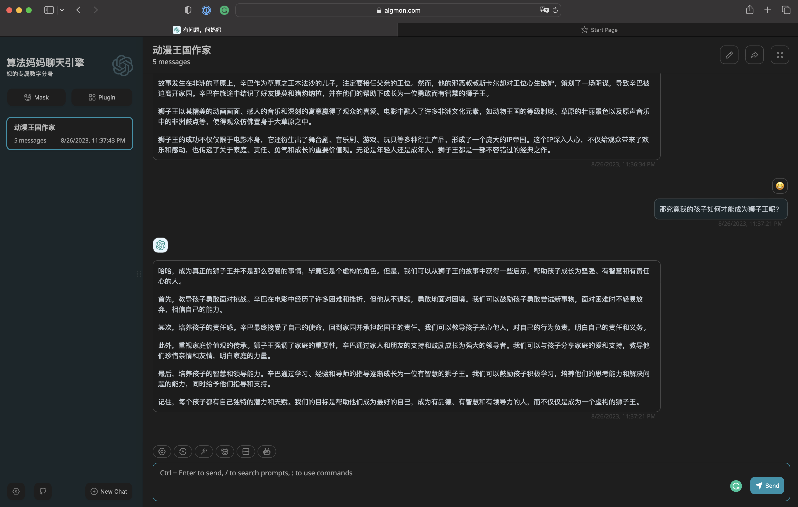

# 目标：构建业界顶级垂类知识库
## 教培行业
### 五年级数学上

1. 练习一 P4 对应问答对文档为 练习一.qa.csv
2. 练习二 P8 P9 P10
3. 练习三 P13 P14
4. 练习四 P17 P18
5. 练习五 P21 P22 P23
6. 练习六 P26 P27
7. 练习七 P30 P31
8. 练习八 P36 P37 P38
9. 练习九 P40 P41 P42
10. 练习十 P43
11. 练习十一 P47 P48 P49
12. 练习十二 P55 P56 P57
13. 练习十三 P60 P61
14. 练习十四 P66
15. 练习十五 P70 P71
16. 练习十六 P74 P75
17. 练习十七 P79 P80 P81
18. 练习十八 P82 P83
19. 练习十九 P87 P88
20. 练习二十 P91 P92
21. 练习二十一 P95 P96
22. 练习二十二 P99 P100 P101
23. 练习二十三 P102 P103
24. 练习二十四 P107 P108
25. 练习二十五 P110 P111 P112 P113 P114 P115

## 人工智能行业
### 论文列表 (./KB/unstructured)

0. 0 图像分割
1. 1 Yolo综述
2. 2 视觉和语言
3. 3 排序
4. 4 跨模态
5. 5 损失函数和评价指标
6. 6 元宇宙
7. 7 ChatGPT
8. 8 ChatGPT
9. 9 目标检测
10. 10 AIGC
11. 11 CNN剪枝
12. 12 ChatGPT机器人
13. 13 Tuning
14. 14 零样本分割
15. 15 智能体 

### 对应问答对列表 (./KB/structured)

* 问答列表和文章编号一一对应

## 算法妈妈简介

* 算法妈妈是一家业界领先的人工智能公司，专注于垂类大模型的生态研发。公司的主要业务包括垂类大模型的训练与部署，以及相关的上下游应用。算法妈妈致力于提供高质量的人工智能解决方案，帮助客户在各个领域实现业务的智能化升级。作为一家技术驱动的公司，算法妈妈拥有一支专业的研发团队，不断进行技术创新和产品优化，以满足客户的需求。

## 算法妈妈核心产品

* 聊天引擎
* 有问题，问妈妈
* https://www.algmon.com/

## 创始人简介
* 江纬，人称东山口死肥仔，粤港澳AI智库特聘专家，同时是一个互联网连续创业者，专注于大数据与人工智能领域。他的学历背景非常丰富，本科计算机毕业于广东工业大学，硕士毕业于南加州大学及在纽约大学攻读博士，可以说是达到入门基本的学霸。他曾服务于Google，蓝盾及在软通等知名企业，积累了丰富的业界经验。现在，他是算法妈妈的创始人，在互联网界独树一帜。