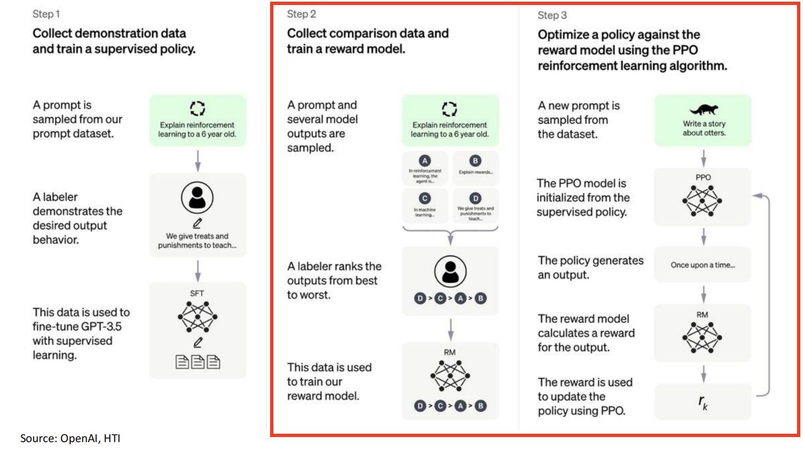
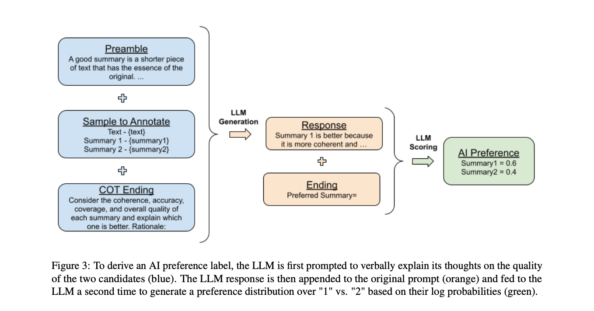

# 算法妈妈垂类知识库 algmon kb
## 目标
* 构建行业领先垂类AIGC知识库

## 新闻
* 20240201 我们开始构建买手看款垂类数据库
* 20231112 我们使用GPTs重构我们的产品与服务
* 20230909 数据标注从Human Feedback过渡到AI Feedback
* 20230907 我们使用argilla平台进行数据标注
* 20230905 项目在github上开源 遵守MIT协议
* 20230901 由本知识库驱动的AI熊猫Rita正式上线 服务签约5所中小学和1所大学

## 简介
* 首先欢迎大家加入以构建和修正行业知识库的精度和推导过程中的数理逻辑！
* 知识库目前已用于智能聊天机器人AI熊猫Rita的训练与预测中
* 目前AI熊猫Rita的问答准确度可查看文件model.precision.csv，一次通过率约为70%
* 欢迎使用Github PR进行贡献，详情可查看项目对应Open Issues

## 具体任务和职责
* 我们需要您不断向AI熊猫Rita创建问题并提问，如直接提问及使用Python进行自动化测试等方式，评估其返回结果的满意度进而更新相应评估表格，以优化我们的垂类大模型Reward Model及PPO算法（如下图红色框图所示）
* 一个简单例子请见下，您需要构建10条有效问答对，以评估了垂类大模型返回的答案是否通过
* https://github.com/weijiang2023/algmon-kb/blob/main/kb/structured/domain.教培/domain.math.grade.5.上/练习1.qa.csv
* 扫码加熊猫好朋友通过以后使用“bot ”作为前缀即可开始测试
* 目前问题集出自人教版教科书，权威教辅材料等

* RLHF for Large Language Model (LLM)

## 验收依据
* 聊天过程富粘性且积极正向
* 问答过程遵循“信达雅”
* 事实性问题无事实性信息错误
* 逻辑推理问题无数理逻辑缺失且最终答案正确

## 如何马上开始贡献工作？
* 扫码熊猫并加好友
* 提交PR以解决某个运营端Open Issue 详见：https://github.com/weijiang2023/algmon-kb/issues

## 重要目录
* ./kb 知识库 包含结构化数据（问答对）与非结构化数据
* ./script 脚本 如计算模型准确度

## 教培行业知识库
* 有效问答对数量：261
* 模型准确度：
* 00.五年级数学上习题总结表.csv （构建完成）
* 01.五年级数学下习题总结表.csv （构建中）
* 02.六年级数学上习题总结表.csv （构建中）
* 03.六年级数学下习题总结表.csv （待构建）
* 04.四年级数学上习题总结表.csv （待构建）
* 05.四年级数学下习题总结表.csv （待构建）

## 人工智能行业知识库
* 有效问答对数量：
* 模型准确度：
* 论文总结表.csv

## AI熊猫Rita智能问答机器人

* AI熊猫Rita是算法妈妈联合棉花糖王国，专为小朋友打造的知识问答型聊天机器人。专注于小学知识点和解题方法的推导。

## 理论基础
* 智能体约可分为大脑及四肢，在实际场景下的表现受奖励函数制约
* 黄金三元组（问题，答案，批改）

* 未成熟智能体通过不断回答现实场景中的实际问题而得到更高层次智能体对答案的批改，进而对自身解题能力进行演化
* From human feedback to AI feedback

## 算法妈妈简介

* 算法妈妈是一家业界领先的人工智能公司，专注于垂类大模型的生态研发。公司的主要业务包括垂类大模型的训练与部署，以及相关的上下游应用。算法妈妈致力于提供高质量的人工智能解决方案，帮助客户在各个领域实现业务的智能化升级。作为一家技术驱动的公司，算法妈妈拥有一支专业的研发团队，不断进行技术创新和产品优化，以满足客户的需求。
* 算法妈妈的使命并不是自研大模型底座，而是为客户提供经整合微调的垂类大模型服务。

## 创始团队简介
* 江纬，人称东山口死肥仔，粤港澳AI智库特聘专家，是一个互联网连续创业者，专注于大数据与人工智能领域。他的学历背景丰富，本科计算机毕业于广东工业大学，硕士计算机毕业于南加州大学及在纽约大学攻读博士。他曾服务于Google，软通等知名企业，积累了丰富的业界经验。他目前是算法妈妈创始人，通过使用人工智能赋能实体经济，目前负责公司产品和技术团队；
* 张优玲，20年服装行业时尚买手经验，数十年教培业务教务长数据运营和管理经验，曾为多个知名时尚品牌进行单品设计，服饰搭配，优化供应链等，目前负责公司运营团队及客户关系；
* 张小兵，20年服装时尚行业买手及销售经验，负责公司市场和营销团队；
* Mark，20年教培行业教学经验，目前负责公司公司市场及项目开拓，前期商务对接等；

## 战略合作伙伴
### 教育行业
* 广州市大南路小学
* 广州市八旗二马路小学
* 广州市文德路小学
* 执信中学
* 广东实验中学
* 华侨中学
* 广东工业大学

### 互联网行业
* 小红花
* 回甘社
* TGO
* LinkAI
* OPEN AI
* 百度

## 基本项目贡献要求
* 踏实肯干的职业态度
* 精通python，git等全栈研发工具
* 优秀团队合作能力
* 对大模型及垂类行业有所了解是加分项

## 笔试
* 知识库智能体实现
* 笔试为可选，优秀答题同学有机会加入算法妈妈核心研发团队中
* ./interview/README.md

## 术语
* prompt 提示词
* prompt engineering 提示词工程
* text 文本
* annotate 标注
* jsonl 一种通用数据存储格式
* human feedback 人类反馈
* reward model 奖赏模型
* argilla 数据标注平台
