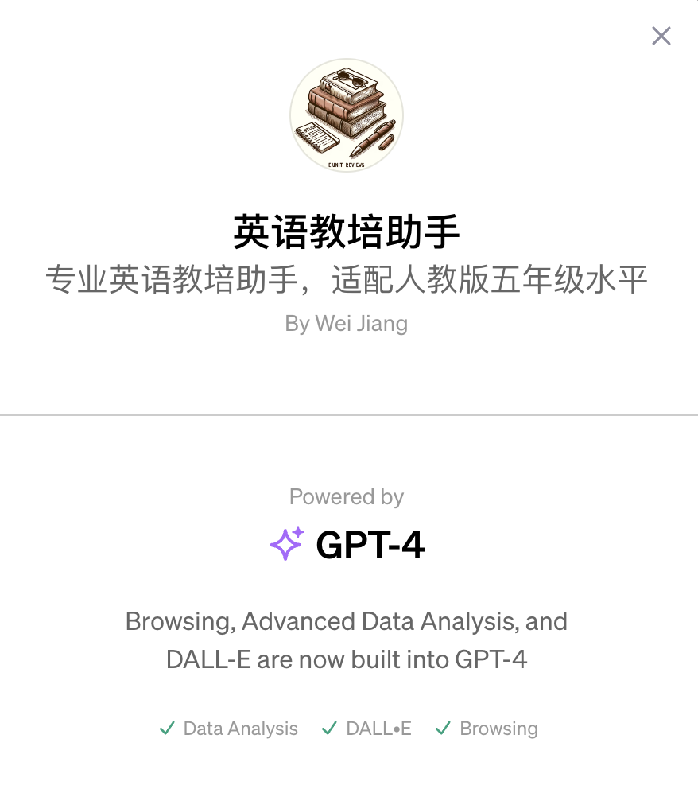

# 英语教培助手

## 更新日志
* 20231116 包含五年级（上）前8个单元内容

## 简介
专业英语教培助手，适配人教版五年级水平。为广大同学提供预习、课程及复习指导。

## 如何使用？
可通过自然语言提问的方式进行，如输入
1. 第七单元所学单词？
2. 请给出第八单元英文课文原文
3. 第三单元概要？

## 目前包含的内容 & 知识清单
五年级（上）
1. 第一单元
2. 第二单元
3. 第三单元
4. 第四单元
5. 第五单元
6. 第六单元
7. 第七单元
8. 第八单元

## 体验地址
https://chat.openai.com/g/g-6hiuh8xlq-ying-yu-jiao-pei-zhu-shou

## 核心技术
垂类大模型

## 知识库
（见本文件夹）

## 版权所有
* 算法妈妈

## 参考资料
* 人教版英文教材
* 5.3天天练