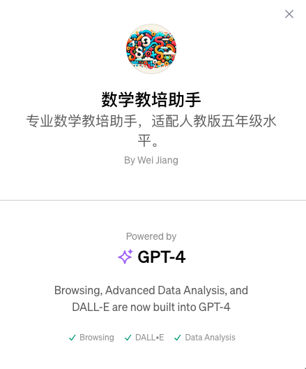

# 数学教培助手

## 更新日志
* 20231117 知识库初始化

## TODOs
* ADD Unit 1 - 5

## 简介
专业数学教培助手，适配人教版五年级水平。为广大同学提供预习、课程及复习指导。

## 如何使用？
通过自然语言提问的方式进行，如输入
1. 第五单元所学知识点
2. 解方程的步骤
3. 如何解方程

## 目前包含的内容 & 知识清单
五年级（上）
1. 第一单元
2. 第二单元
3. 第三单元
4. 第四单元
5. 第五单元

## 体验地址
https://chat.openai.com/g/g-ZwpvqePUN-shu-xue-jiao-pei-zhu-shou

## 核心技术
垂类大模型

## 知识库
（见本文件夹）

## 版权所有
* 算法妈妈

## 技术提供
* OpenAI

## 参考资料
* 人教版英文教材
* 5.3天天练